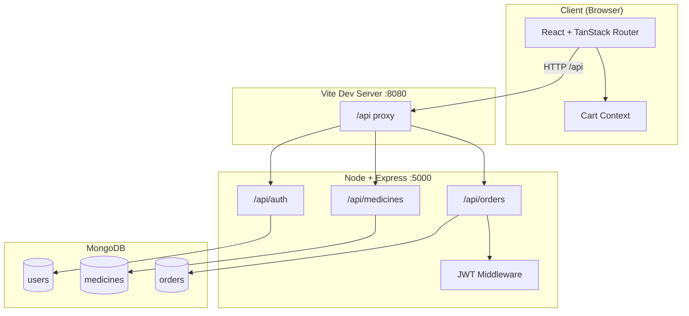
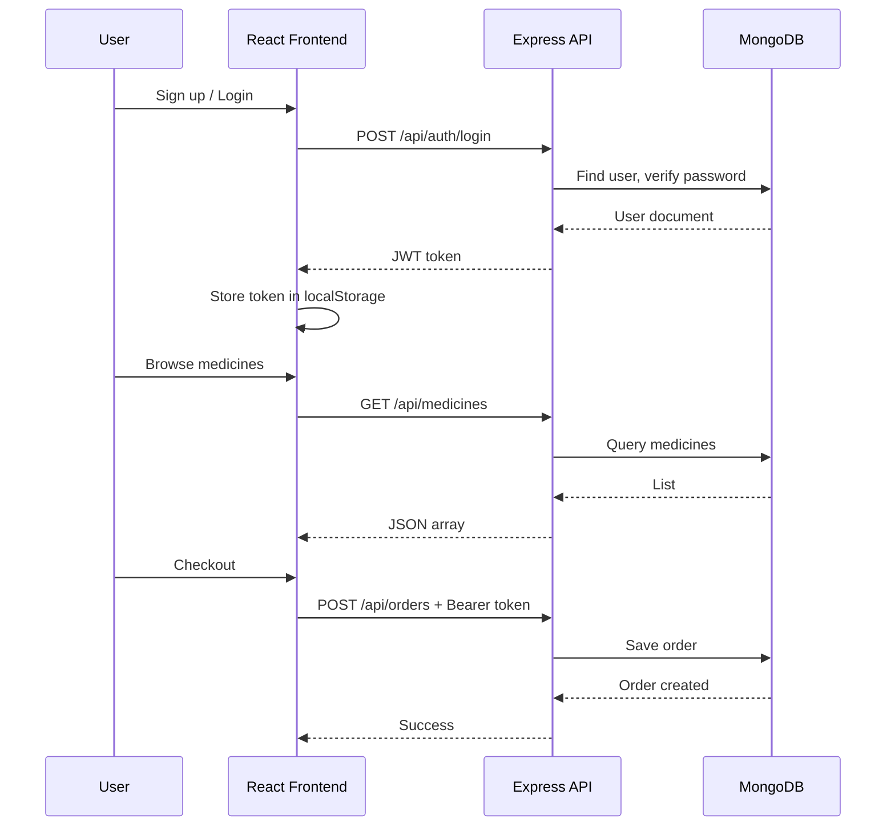

# MediRush — Lab Guide (VS Code)

Use this guide for your external lab. Run everything from **VS Code** (same steps work in Cursor).

---

## Quick start in VS Code

1. **Start MongoDB** (Windows):
   ```powershell
   net start MongoDB
   ```
2. Open folder: `MediRush-main`
3. **Terminal → Run Task** (`Ctrl+Shift+P` → `Tasks: Run Task`)
   - First time: **MediRush: Install dependencies**
   - First time only: **MediRush: Seed database**
   - Every lab day: **MediRush: Run (backend + frontend)** ← default build task (`Ctrl+Shift+B`)
4. Open browser: **http://localhost:8080**

Or from terminal (project root):

```powershell
npm run install:all
npm run seed
npm run dev
```

| Service   | URL                      |
|-----------|--------------------------|
| Frontend  | http://localhost:8080    |
| Backend   | http://localhost:5000    |

---

## Why you saw "Failed to fetch"

| Cause | Fix |
|-------|-----|
| Only backend running, frontend not started | Run **both** (task or `npm run dev`) |
| Frontend deps missing (`vite` not found) | `npm run install:all` in `frontend/` |
| MongoDB not running | `net start MongoDB` |
| Wrong URL | Use **8080** for app, not 5000 |

The app now calls `/api` on the frontend port; Vite proxies requests to the backend on port 5000.

---

## Project objectives (short)

1. **Online medicine ordering** — browse, search, and filter medicines.
2. **User accounts** — register/login with JWT; optional Google OAuth.
3. **Shopping cart** — add medicines, change quantities, checkout.
4. **Order management** — place orders with address and payment method; view order history.
5. **Fast delivery UX** — responsive UI themed for quick medicine delivery (MediRush).

---

## MERN stack (short)

| Letter | Technology in MediRush | Role |
|--------|------------------------|------|
| **M** | MongoDB + Mongoose | Store users, medicines, orders |
| **E** | Express.js (Node) | REST API (`/api/auth`, `/api/medicines`, `/api/orders`) |
| **R** | React 19 + TanStack Router | UI pages: dashboard, auth, checkout |
| **N** | Node.js | Runs the backend server |

**Also used:** TypeScript, Tailwind CSS, JWT, bcrypt, Vite.

---

## Methodology

Agile-style **iterative development** with clear layers:

1. **Requirements** — medicine catalog, auth, cart, checkout, 30-min delivery concept.
2. **Design** — UI mockups (Lovable), MongoDB schemas (`User`, `Medicine`, `Order`).
3. **Implementation**
   - Backend first: models → routes → JWT middleware.
   - Frontend: API client → pages → cart context.
4. **Integration** — REST API + CORS/proxy; test login → browse → order flow.
5. **Testing** — manual end-to-end in browser; seed data for demo medicines.
6. **Deployment-ready** — `.env` for secrets; frontend build with Vite.

**Data flow:** Browser → React → `fetch('/api/...')` → Express → Mongoose → MongoDB.

---

## Architecture diagram



---

## Request flow (login → order)



---

## Folder structure (exam reference)

```
MediRush-main/
├── frontend/          # React app (port 8080)
│   └── src/lib/api.ts # API calls
├── backend/           # Express API (port 5000)
│   ├── models/        # Mongoose schemas
│   ├── routes/        # API endpoints
│   └── server.js      # Entry point
├── .vscode/tasks.json # VS Code one-click run
└── LAB_GUIDE.md       # This file
```

---

## Lab checklist (day of exam)

- [ ] MongoDB service running
- [ ] `npm run install:all` (once)
- [ ] `npm run seed` (once, if DB empty)
- [ ] `Ctrl+Shift+B` or task **MediRush: Run**
- [ ] Open http://localhost:8080
- [ ] Sign up → login → add medicine → checkout

Good luck with your lab.
